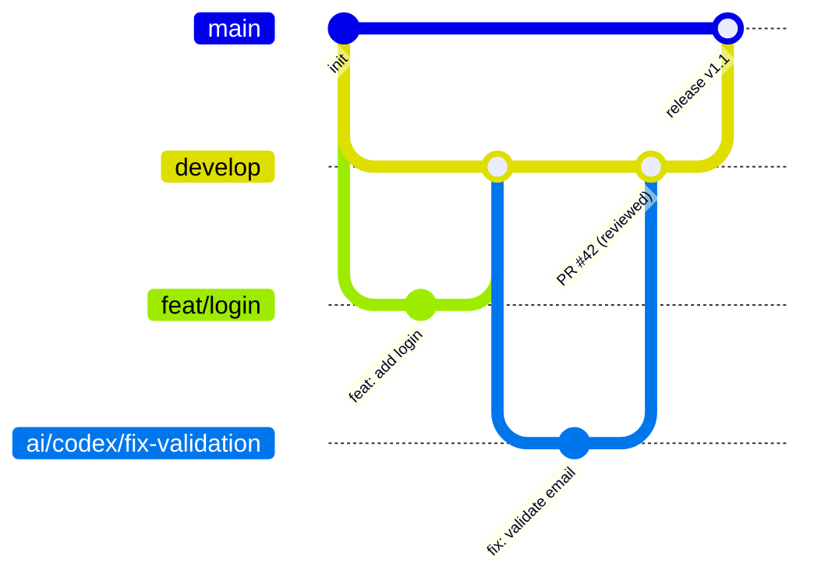

# 0-B.4 — Methodology and Framework Selection and Configuration

## Description

Prompt to select, document, and operationally configure the project methodology and framework: workflow definition, ceremonies, roles, branching strategy, Definition of Ready, Definition of Done, and how AI agent work integrates into the process.

**When to use:** when starting a project, when formalizing an existing one that grew without methodology, or when AI agents are being incorporated and their place in the process needs to be defined.

---

## Mandatory Previous Context

> Include the block from file `00-framework.en.md` before this prompt.

---

## Complete Prompt

```text
Objective:
Select, document, and configure the project framework so it is operable by the human team and assigned AI agents.

Required inputs:
- project type: [product / service / library / internal tool / migration / other]
- team size: [number of people + types of AI agents]
- expected delivery frequency: [daily / weekly / per sprint / continuous]
- candidate or chosen methodology: [SCRUM / Kanban / Trunk-Based / GitFlow / GitHub Flow / RUP / no formal one yet]
- third-party integrations or dependencies: [external APIs, services, other teams]
- current team maturity level: [beginning / intermediate / mature]

Deliver:

1. METHODOLOGY RECOMMENDATION
   - selected methodology and justification
   - recommended variations or adaptations for this case
   - alerts if the methodology requires conditions the team doesn't yet meet

2. BRANCH STRATEGY
   Diagram and description of the branch flow:
   - permanent branches and their purpose
   - short-lived branches and naming convention (feat/, fix/, hotfix/, chore/, etc.)
   - merge rule: PR required / direct merge / squash / rebase
   - when to create a release branch
   - namespacing policy for AI agent branches (e.g., ai/codex/fix-login)

3. DEFINITION OF READY (DoR) — CRITERIA TO START AN ISSUE/TASK
   List of conditions a task must meet before being assigned to a developer or AI agent:
   - complete functional and technical description
   - measurable acceptance criteria
   - identified impact and involved files
   - documented restrictions and business rules
   - explicit dependencies
   - for AI agents: sufficient repository context attached

4. DEFINITION OF DONE (DoD) — CRITERIA TO CLOSE A TASK
   - code implemented and reviewed
   - unit tests written and passing
   - integration with destination branch without conflicts
   - documentation updated if there was interface change
   - basic security review completed
   - reviewer approval (human or automatic according to level)
   - for AI agents: human validation of output before merge

5. COMPLETE ISSUE FLOW
   Textual or Mermaid diagram of the lifecycle:
   Backlog → Ready → In progress (human or agent) → Code Review → QA → Accepted → Done

6. CEREMONIES AND CADENCE (if SCRUM/Kanban applies)
   - what meetings exist, who participates, expected duration
   - how AI agents participate or report in the process

7. OPERATIONAL DOCUMENTATION TO CREATE
   List of files to create in docs/ to formalize the framework:
   - docs/workflow.md: workflow and branching
   - docs/definition-of-ready.md
   - docs/definition-of-done.md
   - docs/team-conventions.md: code conventions, commits, PRs

Output format:
- branch flow diagram (Mermaid or ASCII)
- DoR and DoD table with category and criterion
- instructions for registering the framework in the repo (what files to create and where)
```

---

## Usage with Standard Formula

```text
Use the methodology and framework prompt and adapt it to:
- project type: [TYPE]
- team size: [NUMBER + AI AGENTS]
- delivery frequency: [CADENCE]
- candidate methodology: [METHODOLOGY OR "none"]
- maturity level: [LOW / MEDIUM / HIGH]
- documents to review: README, CONTRIBUTING, current issues, repository structure
- specific output goal: documented branch strategy + DoR + DoD + issue flow for humans and AI agents
- depth level: high
```

---

## Expected Output



| Criterion | DoR (to start) | DoD (to close) |
|---|---|---|
| Description | Clear functional and technical | Code implemented |
| Acceptance criteria | Defined and measurable | Verified and evidenced |
| Tests | Identified what to cover | Written and passing |
| Security | Risks identified | Basic review completed |
| Documentation | Impact identified | Updated if there was change |
| For AI agents | Repo context attached | Human validation completed |
