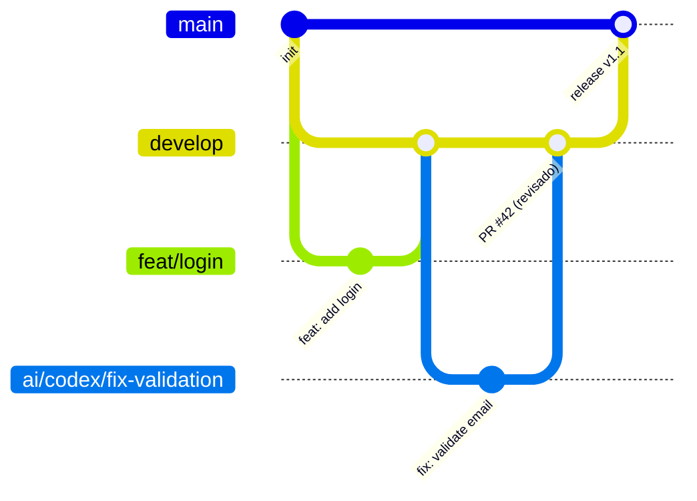

# 0-B.4 — Selección y configuración de metodología y marco de trabajo

## Descripción

Prompt para seleccionar, documentar y configurar operativamente la metodología y el marco de trabajo del proyecto: definición de flujo de trabajo, ceremonies, roles, estrategia de branching, Definition of Ready, Definition of Done, y cómo se integra el trabajo de agentes IA en el proceso.

**Cuándo usarlo:** al iniciar un proyecto, al formalizar uno existente que creció sin metodología, o cuando se incorporan agentes IA y se necesita definir su lugar en el proceso.

---

## Contexto obligatorio previo

> Incluye el bloque del archivo `00-framework.md` antes de este prompt.

---

## Prompt completo

```text
Objetivo:
Selecciona, documenta y configura el marco de trabajo del proyecto para que sea operable por el equipo humano y los agentes IA asignados.

Inputs requeridos:
- tipo de proyecto: [producto / servicio / librería / herramienta interna / migración / otro]
- tamaño del equipo: [número de personas + tipos de agentes IA]
- frecuencia de entregas esperada: [diaria / semanal / por sprint / continua]
- metodología candidata o elegida: [SCRUM / Kanban / Trunk-Based / GitFlow / GitHub Flow / RUP / nada formal aún]
- integraciones de terceros o dependencias: [APIs externas, servicios, otros equipos]
- nivel de madurez actual del equipo: [inicio / intermedio / maduro]

Entrega:

1. RECOMENDACIÓN DE METODOLOGÍA
   - metodología seleccionada y justificación
   - variaciones o adaptaciones recomendadas para este caso
   - alertas si la metodología requiere condiciones que el equipo aún no cumple

2. ESTRATEGIA DE BRANCHES
   Diagrama y descripción del flujo de ramas:
   - ramas permanentes y su propósito
   - ramas de vida corta y convención de nombres (feat/, fix/, hotfix/, chore/, etc.)
   - regla de merge: PR requerido / merge directo / squash / rebase
   - cuándo se crea una rama de release
   - política de namespacing para ramas de agentes IA (ej: ai/codex/fix-login)

3. DEFINITION OF READY (DoR) — CRITERIOS PARA INICIAR UN ISSUE/TAREA
   Lista de condiciones que debe cumplir una tarea antes de asignarse a desarrollador o agente IA:
   - descripción funcional completa
   - criterios de aceptación medibles
   - impacto y archivos involucrados identificados
   - restricciones y reglas de negocio documentadas
   - dependencias resueltas o explícitas
   - para agentes IA: contexto de repositorio suficiente adjunto

4. DEFINITION OF DONE (DoD) — CRITERIOS PARA CERRAR UNA TAREA
   - código implementado y revisado
   - pruebas unitarias escritas y verdes
   - integración con rama destino sin conflictos
   - documentación actualizada si hubo cambio de interfaz
   - revisión de seguridad básica completada
   - aprobación de reviewer (humano o automática según nivel)
   - para agentes IA: validación humana del output antes de merge

5. FLUJO COMPLETO DE UN ISSUE
   Diagrama textual o Mermaid del ciclo de vida:
   Backlog → Ready → En progreso (humano o agente) → Code Review → QA → Aceptado → Done

6. CEREMONIES Y CADENCIA (si aplica SCRUM/Kanban)
   - qué reuniones existen, quién participa, duración esperada
   - cómo participan o reportan los agentes IA en el proceso

7. DOCUMENTACIÓN OPERATIVA A CREAR
   Lista de archivos a crear en docs/ para formalizar el marco de trabajo:
   - docs/workflow.md: flujo de trabajo y branching
   - docs/definition-of-ready.md
   - docs/definition-of-done.md
   - docs/team-conventions.md: convenciones de código, commits, PRs

Formato de salida:
- diagrama de flujo de branches (Mermaid o ASCII)
- tabla DoR y DoD con categoría y criterio
- instrucciones para registrar el marco en el repo (qué archivos crear y dónde)
```

---

## Uso con fórmula estándar

```text
Usa el prompt de metodología y marco de trabajo y adáptalo a:
- tipo de proyecto: [TIPO]
- tamaño del equipo: [NÚMERO + AGENTES IA]
- frecuencia de entregas: [CADENCIA]
- metodología candidata: [METODOLOGÍA O "ninguna"]
- nivel de madurez: [BAJO / MEDIO / ALTO]
- documentos a revisar: README, CONTRIBUTING, issues actuales, estructura del repo
- objetivo puntual de salida: estrategia de branches documentada + DoR + DoD + flujo de issue para humanos y agentes IA
- nivel de profundidad: alto
```

---

## Salida esperada



| Criterio | DoR (para iniciar) | DoD (para cerrar) |
|---|---|---|
| Descripción | Funcional y técnica clara | Código implementado |
| Criterios aceptación | Definidos y medibles | Verificados y evidenciados |
| Pruebas | Identificadas qué cubrir | Escritas y verdes |
| Seguridad | Riesgos identificados | Revisión básica completada |
| Documentación | Impacto identificado | Actualizada si hubo cambio |
| Para agentes IA | Contexto de repo adjunto | Validación humana completada |
