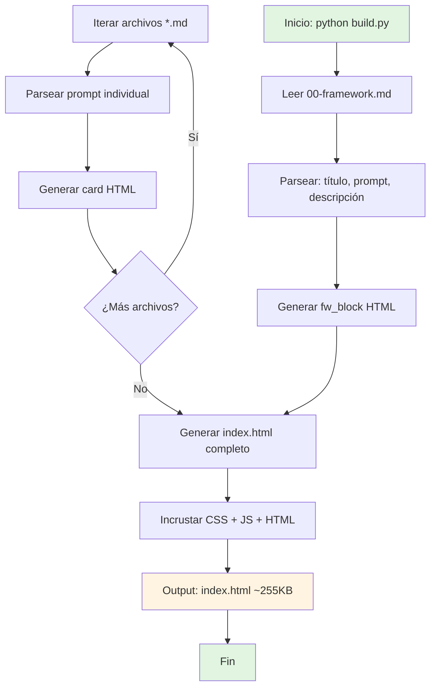
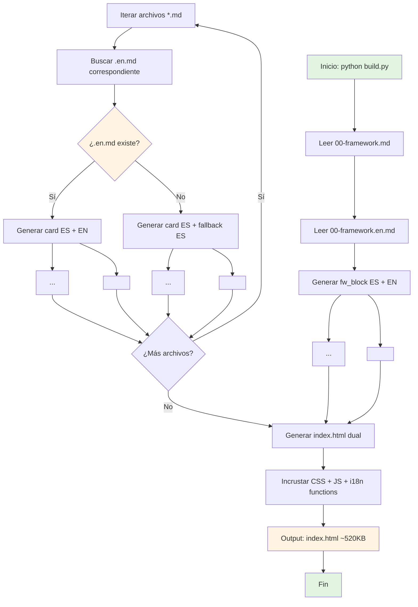
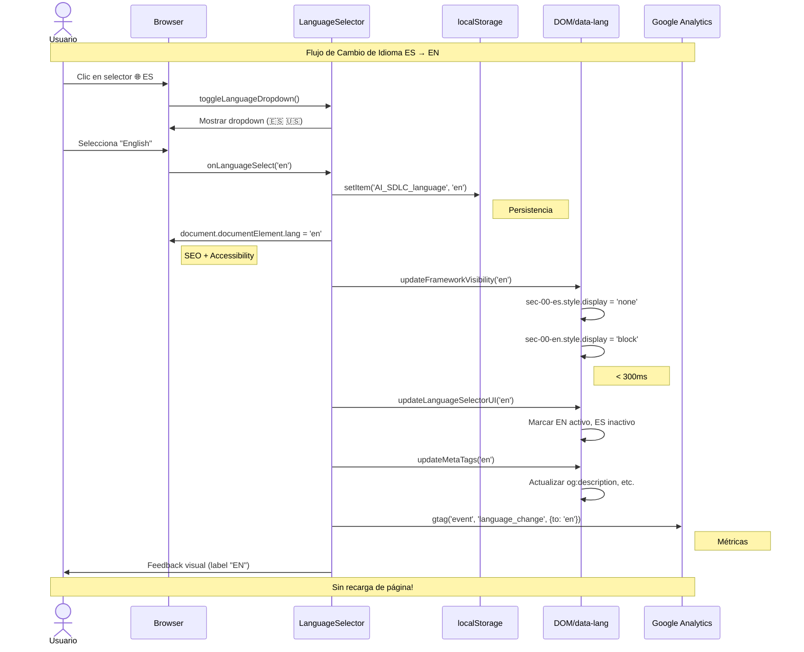
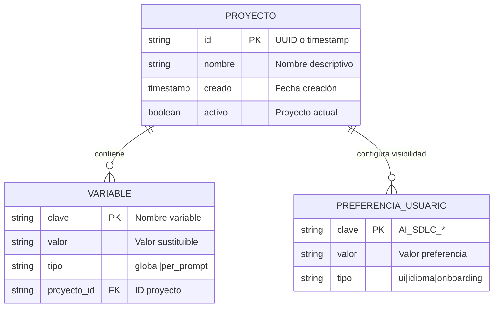
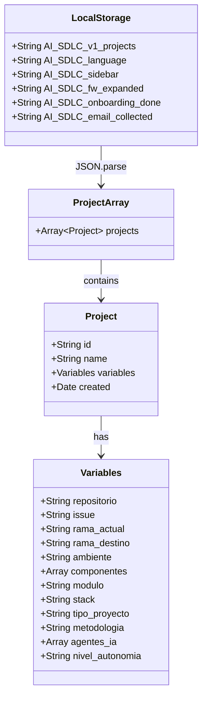
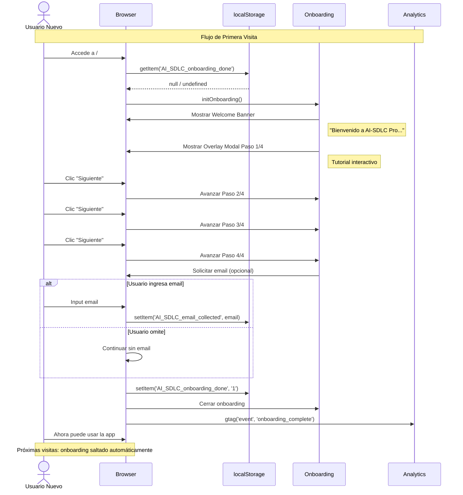

# Diagramas de Arquitectura
## AI-SDLC Pro — Documentación Visual del Sistema

---

## 1. Diagrama de Flujo: Proceso de Build (Actual vs Propuesto i18n)

### Flujo Actual (Monolenguaje ES)



### Flujo Propuesto (Bilingüe ES/EN)



**Explicación:**
- **Actual:** Build simple lee archivos `.md` y genera HTML monolenguaje (~255KB)
- **Propuesto:** Build dual lee tanto `.md` (ES) como `.en.md` (EN), genera ambos bloques con `data-lang` atributos (~520KB). El fallback muestra ES si EN no existe.

---

## 2. Diagrama de Secuencia: Cambio de Idioma (i18n)



**Explicación:**
Muestra la interacción completa cuando usuario cambia idioma. El sistema persiste en localStorage, actualiza DOM con `data-lang` selectores, y trackea en GA. Críticamente: **sin recarga de página** para experiencia instantánea.

---

## 3. Diagrama de Componentes: Arquitectura del Sistema

```mermaid
graph TB
    subgraph "Generación (Build Time)"
        A1[ai_sdlc_pro_prompts/]
        A1 --> B1[00-framework.md]
        A1 --> B2[00-framework.en.md]
        A1 --> B3[01-01-*.md ... 44 archivos]
        
        C1[build.py] --> D1[Parser Markdown]
        C1 --> D2[Generador HTML]
        C1 --> D3[i18n_strings.py]
        
        D1 --> E1[index.html]
        D2 --> E1
        D3 --> E1
        
        F1[verify_clean.py] --> F2{QA Gate}
        F2 -->|Pass| G1[Deploy GitHub Pages]
        F2 -->|Pass| G2[Deploy GCP]
        F2 -->|Fail| H1[Error CI/CD]
        
        E1 --> F2
    end
    
    subgraph "Runtime (Browser)"
        I1[Usuario] --> I2[Navegador]
        I2 --> I3[index.html cargado]
        
        I3 --> J1[Router Client-Side]
        J1 -->|/| J2[Landing Page]
        J1 -->|/app| J3[App SPA]
        
        J3 --> K1[UI Components]
        K1 --> K2[LanguageSelector]
        K1 --> K3[ProjectManager]
        K1 --> K4[PromptCards]
        K1 --> K5[SearchFilter]
        K1 --> K6[VariablePanel]
        
        J3 --> L1[Core Logic]
        L1 --> L2[copyPrompt()]
        L1 --> L3[i18n Engine]
        L1 --> L4[LocalStorage Manager]
        
        J3 --> M1[Data Layer]
        M1 --> M2[localStorage API]
        M2 --> M3[Proyectos + Variables]
        M2 --> M4[Preferencias UI]
        M2 --> M5[Idioma]
        
        J3 --> N1[Analytics]
        N1 --> N2[Google Analytics 4]
    end
    
    G1 --> I2
    G2 --> I2
    
    style C1 fill:#e1f5e1
    style I3 fill:#fff4e1
    style K2 fill:#ffe1e1
```

**Explicación:**
Arquitectura de dos fases:
1. **Build Time:** Python genera HTML estático desde Markdown. QA gate valida antes de deploy dual (GitHub Pages + GCP).
2. **Runtime:** SPA vanilla JS sin backend. Componentes modulares (selector idioma, proyectos, prompts). Persistencia 100% localStorage. Analytics solo para métricas.

---

## 4. Diagrama Entidad-Relación: Datos de localStorage



### Modelo de Datos localStorage (Schema v1)



**Explicación:**
Modelo de datos 100% client-side:
- **Proyectos:** Array JSON con ID, nombre, timestamp, y objeto variables
- **Variables:** 12 campos string/array según tipo (globales vs por-prompt)
- **Preferencias:** Claves sueltas para UI state (sidebar, idioma, onboarding)
- **Relaciones:** Uno-a-muchos (proyecto → variables). No hay relaciones complejas (normalizado en JSON).

---

## 5. Diagrama de Flujo: Copiado de Prompt (Core Functionality)

```mermaid
flowchart TD
    A[Usuario: Clic Copiar] --> B{¿Prompt regular o framework?}
    
    B -->|Regular| C[Obtener framework
    00-framework.md]
    B -->|Framework| D[Solo framework]
    
    C --> E[Obtener contenido prompt
    id=02-01]
    D --> F[Obtener contenido framework]
    
    E --> G[Concatenar:
    framework + "\n\n" + prompt]
    F --> H[Contenido framework puro]
    
    G --> I{Cargar variables
    proyecto activo}
    H --> J[No aplica variables]
    
    I --> K[localStorage.getItem
    AI_SDLC_v1_projects]
    K --> L[Encontrar proyecto activo]
    L --> M[Objeto variables:
    {repo, issue, ...}]
    
    M --> N[Reemplazar {{VAR}}]
    N --> N1["{{REPO}}" → "urgemy-api"]
    N --> N2["{{ISSUE}}" → "#842"]
    
    J --> O
    N --> O[Texto final listo]
    
    O --> P[navigator.clipboard
    .writeText]
    P --> Q{¿Éxito?}
    
    Q -->|Sí| R[Feedback visual:
    Botón "✓ Copiado"]
    Q -->|No| S[Alert error:
    "No se pudo copiar"]
    
    R --> T[gtag event:
    'copy_prompt']
    T --> U[Fin]
    S --> U
    
    style A fill:#e1f5e1
    style P fill:#fff4e1
    style R fill:#e1f5e1
    style S fill:#ffe1e1
```

**Explicación:**
Flujo crítico del sistema: usuario copia prompt → sistema antepone framework → aplica variables de proyecto → copia a clipboard. El framework nunca se copia solo (siempre prepend para prompts regulares).

---

## 6. Diagrama de Secuencia: Primer Uso (Onboarding)



**Explicación:**
Flujo de primera experiencia: detección de nuevo usuario → tutorial paso a paso → captura opcional de email → flag de completado. Las visitas subsiguientes detectan el flag y omiten onboarding.

---

## Resumen de Diagramas

| Diagrama | Tipo | Propósito | Complejidad |
|----------|------|-----------|-------------|
| **Build Flow** | Flowchart | Proceso de generación actual vs i18n | Media |
| **Cambio Idioma** | Secuencia | Interacción i18n en runtime | Media |
| **Arquitectura** | Componentes | Vista global sistema build+runtime | Alta |
| **Datos localStorage** | ER + Class | Modelo de persistencia cliente | Baja |
| **Copiado Prompt** | Flowchart | Core functionality del producto | Media |
| **Onboarding** | Secuencia | Experiencia primer uso | Baja |

---

**Nota:** Todos los diagramas son consistentes con:
- Código actual de `build.py` (generación estática)
- Estructura real de archivos en `ai_sdlc_pro_prompts/`
- JavaScript implementado en `index.html` (SPA, localStorage)
- Arquitectura de deploy (GitHub Pages + GCP)

