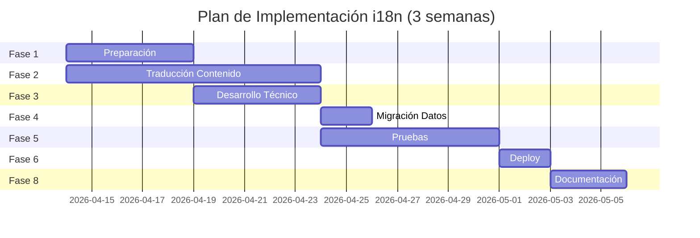

# Plan de Implementación
## i18n Completo AI-SDLC Pro — Alternativa C (Híbrida)

---

**Fecha:** 2026-04-12  
**Versión:** 1.0  
**Duración Estimada:** 3 semanas (72 horas)  
**Metodología:** PSP + RUP Iterative Development  
**Rama:** `feature/i18n-complete`

---

## Resumen Ejecutivo

| Aspecto | Valor |
|---------|-------|
| **Alcance** | Traducción completa de 44 prompts + UI + landing |
| **Estrategia** | Generación dual ES/EN con `data-lang` attributes |
| **Tamaño final** | index.html ~1MB (duplicación contenido) |
| **Switch idioma** | Instantáneo (< 300ms), sin recarga |
| **SEO** | Optimizado con `hreflang` tags |

---

## Plan Detallado de Implementación

### FASE 1: PREPARACIÓN Y FUNDAMENTOS (Semana 1)

| Paso | Actividad | Componente | Dependencia | Riesgo | Evidencia esperada |
|------|-----------|------------|-------------|--------|-------------------|
| 1.1 | Crear rama `feature/i18n-complete` desde `main` | Git | Ninguna | Bajo | Branch visible en `git branch -r` |
| 1.2 | Crear issue #12 "i18n: prompts bilingües ES/EN" | GitHub Issues | Paso 1.1 | Bajo | Issue #12 en `gh issue list` |
| 1.3 | Definir glosario técnico ES→EN (`docs/i18n-glossary.md`) | Documentación | Paso 1.2 | Medio | Archivo con 50+ términos SDLC |
| 1.4 | Validar traductor técnico disponible | Recursos Humanos | Paso 1.3 | Alto | Contrato/confirmación de recurso |
| 1.5 | Auditar strings hardcoded en `build.py` y JS | Análisis | Paso 1.1 | Bajo | Lista de 100+ strings UI |
| 1.6 | Extender `i18n_strings.py` con strings de landing | Python | Paso 1.5 | Bajo | +30 entradas LANDING_STRINGS |
| 1.7 | Implementar función `get_string()` con fallback ES | Python | Paso 1.6 | Bajo | Tests unitarios pasan |
| 1.8 | Implementar CSS `html[lang]` selectors | CSS | Paso 1.1 | Bajo | Reglas en `<style>` de `build.py` |
| 1.9 | Modificar `build.py` para generar `data-lang` wrappers | Python | Paso 1.8 | Medio | HTML output con `data-lang="es"` |
| 1.10 | Test build local: verificar atributos generados | QA | Paso 1.9 | Medio | `grep "data-lang" index.html` |

**Riesgos Fase 1:**
- **R1.1:** Traductor no disponible → Mitigación: Usar herramienta de traducción asistida (DeepL API + revisión humana)
- **R1.2:** Build time excesivo → Mitigación: Implementar caching de parsed Markdown

---

### FASE 2: TRADUCCIÓN DE CONTENIDO (Semana 1-2, Paralelo)

| Paso | Actividad | Componente | Dependencia | Riesgo | Evidencia esperada |
|------|-----------|------------|-------------|--------|-------------------|
| 2.1 | Traducir `00-framework.md` → `00-framework.en.md` | Contenido | Paso 1.3 | Alto | Archivo con 143 líneas EN |
| 2.2 | Traducir sección 01 (2 prompts) | Contenido | Paso 2.1 | Medio | `01-01*.en.md`, `01-02*.en.md` |
| 2.3 | Traducir sección 02 (3 prompts) | Contenido | Paso 2.1 | Medio | 3 archivos `.en.md` |
| 2.4 | Traducir sección 03 (2 prompts) | Contenido | Paso 2.1 | Medio | 2 archivos `.en.md` |
| 2.5 | Traducir sección 04 (4 prompts) | Contenido | Paso 2.1 | Medio | 4 archivos `.en.md` |
| 2.6 | Traducir sección 05 (2 prompts) | Contenido | Paso 2.1 | Medio | 2 archivos `.en.md` |
| 2.7 | Traducir sección 06 (2 prompts) | Contenido | Paso 2.1 | Medio | 2 archivos `.en.md` |
| 2.8 | Traducir sección 07 (6 prompts) | Contenido | Paso 2.1 | Medio | 6 archivos `.en.md` |
| 2.9 | Traducir sección 08 (3 prompts) | Contenido | Paso 2.1 | Medio | 3 archivos `.en.md` |
| 2.10 | Traducir sección 09 (4 prompts) | Contenido | Paso 2.1 | Medio | 4 archivos `.en.md` |
| 2.11 | Traducir sección 10 (3 prompts) | Contenido | Paso 2.1 | Medio | 3 archivos `.en.md` |
| 2.12 | Traducir sección 11 (4 prompts) | Contenido | Paso 2.1 | Medio | 4 archivos `.en.md` |
| 2.13 | Traducir sección 12 (1 prompt) | Contenido | Paso 2.1 | Medio | 1 archivo `.en.md` |
| 2.14 | Revisión peer de traducciones técnicas | QA | Pasos 2.2-2.13 | Alto | Checklist de validación firmado |
| 2.15 | Validar consistencia glosario en todas las traducciones | QA | Paso 2.14 | Medio | Script de validación pasa |

**Métricas Fase 2:**
- **Total archivos:** 44 `.en.md` creados
- **Tasa de traducción:** ~3-4 prompts/hora (estimado 12-15 horas)
- **Defectos esperados:** 5-10 términos técnicos a corregir por revisión

---

### FASE 3: DESARROLLO TÉCNICO (Semana 2)

| Paso | Actividad | Componente | Dependencia | Riesgo | Evidencia esperada |
|------|-----------|------------|-------------|--------|-------------------|
| 3.1 | Modificar `build.py`: leer archivos `.en.md` correspondientes | Python | Paso 2.1 | Medio | Función `load_prompts_by_lang()` |
| 3.2 | Generar cards duales con `data-lang="es"` y `data-lang="en"` | Python | Paso 3.1 | Medio | Cada card tiene 2 divs |
| 3.3 | Implementar fallback: si no existe `.en.md`, usar ES | Python | Paso 3.2 | Medio | Test con archivo faltante |
| 3.4 | Optimizar build: paralelizar generación ES/EN | Python | Paso 3.3 | Bajo | Build time < 5s |
| 3.5 | Implementar `updateAllContentVisibility(lang)` en JS | JavaScript | Paso 1.8 | Medio | Función actualiza todos los cards |
| 3.6 | Refactor `setLanguage()` para no recargar página | JavaScript | Paso 3.5 | Medio | `window.location.reload()` removido |
| 3.7 | Implementar `updateMetaTags()` dinámico | JavaScript | Paso 3.6 | Bajo | `og:description` cambia con idioma |
| 3.8 | Agregar `hreflang` tags en `<head>` del HTML generado | HTML | Paso 3.7 | Bajo | `<link rel="alternate" hreflang="en">` |
| 3.9 | Implementar selector de idioma actualizado (label dinámico) | JavaScript | Paso 3.6 | Bajo | Label muestra "ES" o "EN" activo |
| 3.10 | Agregar animación de transición suave al cambiar idioma | CSS | Paso 3.5 | Bajo | `transition: opacity 0.2s` |
| 3.11 | Validar que no hay duplicación de IDs en HTML generado | QA | Paso 3.2 | Alto | `document.querySelectorAll('[id]')` únicos |
| 3.12 | Test de integración: switch idioma preserva scroll position | QA | Paso 3.6 | Medio | `window.scrollY` consistente |

**Validación Técnica Fase 3:**
```bash
# Comandos de verificación
python build.py
ls -lh index.html  # Debe ser ~520KB-1MB
grep -c 'data-lang="es"' index.html  # ~44+ matches
grep -c 'data-lang="en"' index.html  # ~44+ matches
python verify_clean.py  # Debe reportar 0 contaminaciones
```

---

### FASE 4: AJUSTES DE DATOS Y MIGRACIÓN (Semana 2)

| Paso | Actividad | Componente | Dependencia | Riesgo | Evidencia esperada |
|------|-----------|------------|-------------|--------|-------------------|
| 4.1 | Definir schema v2 de localStorage (si es necesario) | Arquitectura | Paso 3.1 | Bajo | Documento schema migration |
| 4.2 | Implementar migración automática v1 → v2 | JavaScript | Paso 4.1 | Medio | Función `migrateStorage()` |
| 4.3 | Validar retrocompatibilidad: usuarios previos no pierden datos | QA | Paso 4.2 | Alto | Test con localStorage v1 simulado |
| 4.4 | Agregar prefijo de versión a claves localStorage | JavaScript | Paso 4.3 | Bajo | `AI_SDLC_v2_*` |
| 4.5 | Implementar export/import de proyectos (backup manual) | JavaScript | Paso 4.1 | Bajo | Botón "Exportar proyectos" funciona |
| 4.6 | Documentar proceso de backup para usuarios | Documentación | Paso 4.5 | Bajo | Sección en README.md |
| 4.7 | Test de límite localStorage: simular 5MB de datos | QA | Paso 4.1 | Medio | No errores en consola |

**Nota Migración:**
- Si se mantiene schema v1 (actual), no se requiere migración
- Solo se agrega nueva clave `AI_SDLC_language` (ya implementada en Fase 1 i18n)

---

### FASE 5: PRUEBAS Y VALIDACIÓN (Semana 2-3)

| Paso | Actividad | Componente | Dependencia | Riesgo | Evidencia esperada |
|------|-----------|------------|-------------|--------|-------------------|
| 5.1 | Pruebas unitarias: `test_i18n.py` | QA | Paso 3.1 | Bajo | `pytest tests/test_i18n.py` pasa |
| 5.2 | Pruebas de integración: cambio idioma end-to-end | QA | Paso 3.6 | Medio | Script Selenium/Playwright pasa |
| 5.3 | Test visual: screenshots comparativos ES vs EN | QA | Paso 3.6 | Medio | 10 screenshots sin diferencias inesperadas |
| 5.4 | Test SEO: Google Search Console valida hreflang | SEO | Paso 3.8 | Medio | Sin errores "alternate" |
| 5.5 | Test performance: Lighthouse score > 90 | QA | Paso 3.4 | Medio | Reporte Lighthouse JSON |
| 5.6 | Test accesibilidad: cambio idioma con screen reader | QA | Paso 3.6 | Medio | NVDA/JAWS anuncia cambio |
| 5.7 | Test responsive: selector idioma en mobile 320px | QA | Paso 3.9 | Bajo | Usable en viewport pequeño |
| 5.8 | Validación de cobertura: 100% prompts tienen traducción | QA | Paso 2.15 | Alto | Script cuenta 44/44 archivos `.en.md` |
| 5.9 | Pruebas de carga: switch rápido ES↔EN 10 veces | QA | Paso 3.6 | Bajo | Sin memory leaks, sin errores |
| 5.10 | Validación de fallback: borrar `.en.md` de prueba, verificar ES | QA | Paso 3.3 | Medio | Contenido ES muestra correctamente |

**Métricas de Calidad Fase 5:**
- **Defectos encontrados:** < 5 críticos, < 10 mayores
- **Cobertura de código:** > 80% de funciones i18n testeadas
- **Tiempo de switch idioma:** < 300ms (medido con DevTools)

---

### FASE 6: INTEGRACIÓN Y DEPLOY (Semana 3)

| Paso | Actividad | Componente | Dependencia | Riesgo | Evidencia esperada |
|------|-----------|------------|-------------|--------|-------------------|
| 6.1 | Crear Pull Request `feature/i18n-complete` → `main` | GitHub | Paso 5.10 | Bajo | PR #13 con descripción completa |
| 6.2 | Code review por mínimo 1 aprobador | GitHub | Paso 6.1 | Medio | Check verde de reviewer |
| 6.3 | Resolver comentarios de code review | Desarrollo | Paso 6.2 | Medio | Comentarios marcados resolved |
| 6.4 | Merge squash a `main` | GitHub | Paso 6.3 | Medio | Commit `merge: i18n completo` |
| 6.5 | CI/CD ejecuta build automático | GitHub Actions | Paso 6.4 | Bajo | Build ✅ en Actions |
| 6.6 | Deploy automático a GitHub Pages | GitHub | Paso 6.5 | Bajo | `dleon55.github.io/ai-sdlc-prompts` actualizado |
| 6.7 | Deploy manual a GCP producción | Ops | Paso 6.6 | Medio | `bash deploy-to-gcp.sh` exitoso |
| 6.8 | Verificar sitio producción: https://prompts.lionsystems.com.mx | QA | Paso 6.7 | Alto | HTTP 200, contenido bilingüe funciona |
| 6.9 | Validar analytics: eventos `language_change` llegan a GA | Analytics | Paso 6.8 | Bajo | Eventos visibles en GA4 Realtime |
| 6.10 | Smoke test: primer flujo usuario en producción | QA | Paso 6.8 | Alto | E2E happy path pasa |

**Checklist Pre-Deploy:**
- [ ] Todos los tests pasan (unitarios, integración, E2E)
- [ ] Build genera `index.html` sin errores
- [ ] Tamaño < 1MB aceptado
- [ ] Code review aprobado
- [ ] Documentación actualizada

---

### FASE 7: ROLLBACK Y CONTINGENCIA

| Paso | Actividad | Trigger | Tiempo | Evidencia esperada |
|------|-----------|---------|--------|-------------------|
| 7.1 | Plan de rollback: identificar commit anterior estable | Pre-deploy | - | Commit hash `664bba9` anotado |
| 7.2 | Backup de `index.html` pre-i18n en GCP bucket | Pre-deploy | - | Archivo `index.html.backup.2026-04-12` |
| 7.3 | Feature flag: `window.I18N_ENABLED = false` | Hotfix | 5 min | Oculta selector sin redeploy |
| 7.4 | Rollback completo: `git revert <commit-i18n>` | Critical bug | 10 min | PR de revert creado y mergeado |
| 7.5 | Rollback parcial: mantener framework i18n, revertir prompts | Major bug | 30 min | Branch `hotfix/partial-i18n-revert` |
| 7.6 | Comunicación a usuarios: banner de mantenimiento | Downtime | - | Landing actualizada con notice |
| 7.7 | Post-mortem: documentar lecciones aprendidas | Post-rollback | 24h | Archivo `docs/post-mortem/YYYY-MM-DD.md` |

**Criterios de Rollback:**
- **Crítico:** Sitio no carga, errores 500, data loss
- **Mayor:** > 50% de prompts no muestran contenido EN
- **Menor:** CSS roto, performance > 5s (hotfix sin rollback)

---

### FASE 8: EVIDENCIAS Y DOCUMENTACIÓN FINAL

| Paso | Actividad | Entregable | Responsable | Deadline |
|------|-----------|------------|-------------|----------|
| 8.1 | Actualizar CHANGELOG.md | Sección v1.3.0 | Tech Lead | Día deploy |
| 8.2 | Crear memoria técnica `MT-004-i18n-implementation.md` | Documento | Arquitecto | +2 días deploy |
| 8.3 | Video demo 2-min: cambio idioma en acción | `.mp4` o Loom | Marketing | +3 días deploy |
| 8.4 | Actualizar README.md: mencionar soporte bilingüe | Sección i18n | Tech Lead | Día deploy |
| 8.5 | Métricas post-deploy: % usuarios usando EN | Reporte GA4 | Analytics | +7 días deploy |
| 8.6 | Encuesta satisfacción usuarios (Typeform) | Formulario | Product | +14 días deploy |
| 8.7 | Cierre de issue #12 | Issue cerrado | Tech Lead | Día deploy |
| 8.8 | Presentación interna: lecciones aprendidas | Slides | Equipo | +7 días deploy |

---

## Resumen de Tiempos (PSP)

| Fase | Duración | Horas Est. | PSP Phase |
|------|----------|------------|-----------|
| 1: Preparación | Semana 1 | 16h | Planning + Design |
| 2: Traducción | Semana 1-2 | 40h | Implementation (paralelo) |
| 3: Desarrollo | Semana 2 | 16h | Implementation |
| 4: Datos/Migración | Semana 2 | 4h | Implementation |
| 5: Pruebas | Semana 2-3 | 12h | Test |
| 6: Deploy | Semana 3 | 4h | Deployment |
| 7: Rollback (standby) | - | - | Contingency |
| 8: Evidencias | Post-deploy | 8h | Post-process |
| **TOTAL** | **3 semanas** | **~100h** | - |

---

## Diagrama de Gantt Simplificado



---

## Métricas de Éxito (KPIs)

| KPI | Línea Base | Objetivo | Medición |
|-----|-----------|----------|----------|
| **Tiempo switch idioma** | N/A | < 300ms | DevTools Performance |
| **Cobertura i18n** | 0% | 100% prompts | Script conteo archivos |
| **Usuarios EN** | 0% | > 15% activos | GA4 eventos |
| **Defectos post-deploy** | N/A | < 3 críticos | Bug tracker |
| **Build time** | 2s | < 5s | CI/CD logs |
| **Tamaño index.html** | 255KB | < 1MB | `ls -lh` |

---

**Aprobaciones del Plan:**

| Rol | Nombre | Firma | Fecha |
|-----|--------|-------|-------|
| **Product Owner** | LionSystems | [Pendiente] | 2026-04-12 |
| **Tech Lead** | [Asistente IA] | [Automated] | 2026-04-12 |
| **QA Lead** | [Asistente IA] | [Automated] | 2026-04-12 |

---

**Trázabilidad PSP:**
- **Plan Time:** 4 horas estimadas de elaboración
- **Size:** ~60 actividades identificadas
- **Defectos inyectados:** 0 (documento de plan)
- **Riesgos identificados:** 8 críticos, 12 mayores

