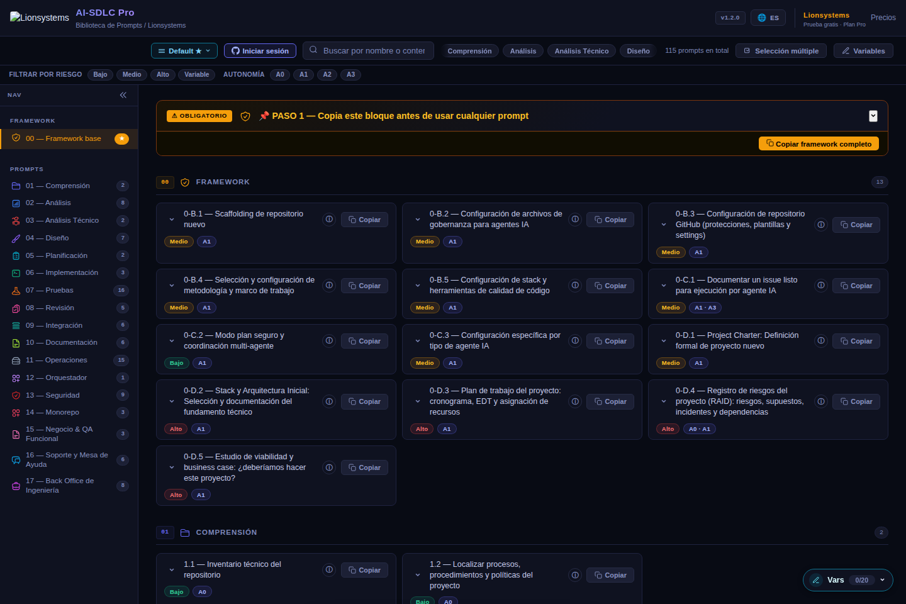
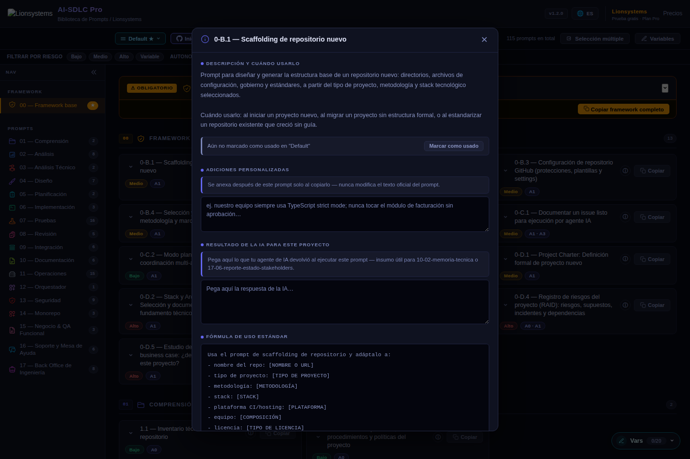
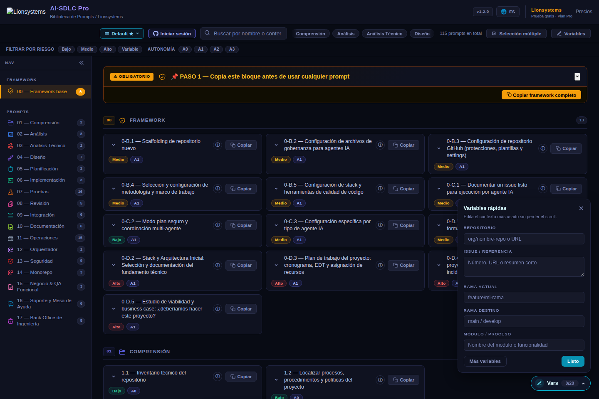

# Artículo Dev.to / Hashnode (issue #11)

> Sprint 3, `docs/STRATEGY.md`. Título sugerido original en el issue decía
> "44 prompts" — desactualizado; el catálogo real tiene 112. Keywords SEO
> objetivo tomadas de `docs/STRATEGY.md`: "prompts ingeniería software IA
> español", "prompts GitHub Copilot SDLC", "biblioteca prompts Claude
> desarrollo software", "AI-SDLC framework español", "prompts multi-agente
> desarrollo software".
>
> Listo para pegar en Dev.to/Hashnode tal cual (formato markdown estándar,
> ambas plataformas lo aceptan sin cambios). Tags sugeridos al final.

---

## Título

**Cómo uso 112 prompts estructurados para dirigir Copilot y Claude en cada fase del SDLC**

## Cuerpo del artículo

```markdown
# Cómo uso 112 prompts estructurados para dirigir Copilot y Claude en cada fase del SDLC

Si usas IA para programar todos los días, seguro ya viviste esto: le pides
algo a Copilot o a Claude, el resultado es *casi* lo que necesitabas, y
terminas reescribiendo el prompt tres veces hasta que el agente entiende el
contexto que en tu cabeza era obvio desde el principio.

El problema casi nunca es el modelo. Es que la mayoría de prompts que
usamos a diario son frases sueltas, no instrucciones de ingeniería.

## El prompt genérico no escala en equipo

"Ayúdame a revisar este PR" o "genera tests para esta función" funcionan
para una tarea aislada. Pero en un equipo real, cada persona prompt-ea
distinto, con contexto distinto, y el resultado es inconsistente entre
quien lleva 5 años programando y quien acaba de entrar.

Eso es un problema de estandarización, no de modelo de IA. Y se resuelve
igual que cualquier otro problema de estandarización en ingeniería de
software: con un proceso repetible.

## Un prompt de ingeniería tiene una estructura, no es una frase

Llevo meses construyendo (y usando en proyectos reales) una biblioteca de
112 prompts estructurados en español, organizados por las 18 etapas del
ciclo de vida del desarrollo de software — desde el project charter hasta
el postmortem de producción. Cada prompt sigue el mismo contrato editorial:

- **Descripción y cuándo usarlo** — para no aplicar el prompt equivocado a
  la tarea equivocada.
- **Riesgo esperado** (bajo / medio / alto / variable) — cuánto cuesta
  deshacer si el agente se equivoca.
- **Inputs requeridos** — qué contexto mínimo necesita el agente antes de
  poder responder algo útil.
- **Autonomía permitida** (A0 a A3) — desde "solo puede leer y analizar"
  hasta "puede ejecutar con supervisión mínima". No todos los prompts
  deberían darle el mismo permiso a un agente.
- **Criterio de parada** — qué debe hacer el agente si algo es ambiguo:
  declarar la ambigüedad, no adivinar.
- **Salida esperada** y **evidencia mínima** — cómo se ve un resultado
  correcto, no solo "algo que suene bien".
- **Siguiente prompt recomendado** — para encadenar la fase siguiente sin
  perder contexto.

Ejemplo real: el prompt de scaffolding de repositorio nuevo no solo pide
"crea la estructura de un repo". Pide tipo de proyecto, metodología, stack,
plataforma de CI/hosting, tamaño de equipo y tipo de licencia — y declara
que el riesgo es medio porque una estructura de repo mal pensada es cara de
rehacer una vez que el equipo ya construyó sobre ella.



## Autonomía explícita: la parte que casi nadie declara

La parte que más ha cambiado cómo mi equipo usa IA es declarar
explícitamente cuánta autonomía tiene el agente en cada tarea:

- **A0** — solo lectura y análisis, cero cambios.
- **A1** — puede proponer cambios, un humano decide.
- **A2** — puede ejecutar cambios acotados y de bajo riesgo.
- **A3** — ejecución con supervisión mínima, para tareas bien definidas y
  de bajo riesgo real.

Un prompt de revisión arquitectónica no debería tener el mismo nivel de
autonomía que uno de formateo de código. Definir esto por prompt, no por
"vibra del momento", evita que un agente termine tomando una decisión de
alto impacto porque nadie se lo prohibió explícitamente.



## Contexto multi-agente: el mismo "cerebro" para Copilot, Claude, Cursor...

Si usas más de un agente de IA en el mismo proyecto — Copilot en el editor,
Claude para planear, Cursor para refactors grandes — el problema no es la
calidad de cada uno por separado. Es que cada uno termina operando con una
versión distinta del contexto del proyecto si no les das lo mismo a todos.

La biblioteca incluye un framework de contexto que se antepone a cualquier
prompt, sin importar el agente que lo reciba: mismo stack, mismas
convenciones del equipo, mismo nivel de autonomía permitido declarado. No
es un prompt más — es la capa base que hace que distintos agentes trabajen
con la misma información, en vez de que cada uno improvise la suya.

## Variables reutilizables entre proyectos

En la práctica, la mayoría de prompts de un mismo proyecto comparten el
mismo contexto: nombre del repo, stack, rama actual, módulo en el que estás
trabajando. Reescribir eso en cada prompt es fricción pura, así que la
biblioteca resuelve un set de ~19 variables por proyecto una sola vez y las
reutiliza en cualquier prompt que las necesite.



## Cómo empezar

El catálogo completo (112 prompts, español e inglés, con el framework de
contexto multi-agente) está disponible gratis, sin cuenta, en
**[prompts.lionsystems.com.mx](https://prompts.lionsystems.com.mx)**. Copiar
cualquier prompt es y seguirá siendo gratis e ilimitado — no hay contenido
oculto detrás de un paywall. Si quieres gestionar más de un proyecto o
guardar personalización/resultados de IA por prompt, eso sí vive detrás de
una sesión con GitHub (con una semana de prueba completa incluida), pero el
catálogo en sí es abierto para cualquiera.

Si tu equipo usa IA todos los días y cada quien prompt-ea distinto, prueba
estandarizar por fase del SDLC en vez de por preferencia individual. La
diferencia no es que el agente se vuelva más inteligente — es que deja de
adivinar qué esperabas de él.

---

¿Qué prompts repites más seguido sin darte cuenta de que ya deberían estar
estandarizados en tu equipo? Los leo en los comentarios.
```

## Tags sugeridos

`ai` `promptengineering` `githubcopilot` `productivity` `softwareengineering`

## Checklist de publicación

- [ ] Pegar el bloque de arriba tal cual en el editor de Dev.to o Hashnode.
- [ ] Subir las 3 imágenes de `docs/marketing/assets/` como imágenes del
      post (Dev.to/Hashnode alojan imágenes propias — no enlazar al repo
      directamente).
- [ ] Cover image: usar `assets/01-catalogo-general.png`.
- [ ] Publicar y enlazar desde LinkedIn (post de anuncio) una vez publicado.
