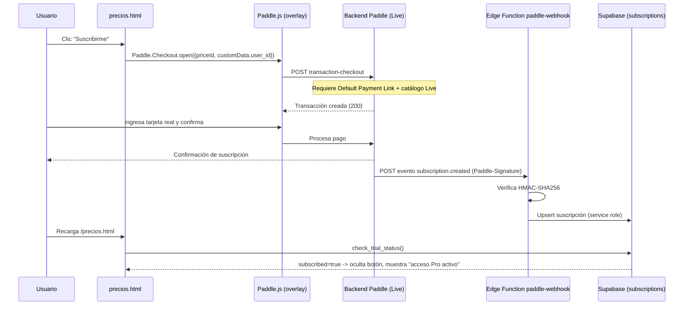

# Diseño detallado y plan de implementación — Paso a producción de pagos (Paddle Billing)

**Estado:** Borrador para ejecución
**Fecha:** 2026-07-29
**Rama de trabajo:** `feature/paddle-go-live`
**Responsable:** David León
**Relacionado:** [`docs/paddle-integration.md`](paddle-integration.md), PRs #130, #132–#135

---

## 1. Objetivo y alcance

### Objetivo
Habilitar el cobro **real** de la suscripción Pro ($1 USD/mes introductorio) migrando la integración de Paddle Billing de **Sandbox** a **Producción (Live)**, con una prueba de pago real verificada de punta a punta (checkout → transacción → webhook → tabla `subscriptions` en Supabase).

### En alcance
- Cambio de configuración del frontend (`build.py` → `precios.html`) para seleccionar credenciales Live. **(Ya implementado en esta rama.)**
- Recreación del catálogo (producto + precio) en la cuenta Live de Paddle.
- Configuración de la *Default Payment Link* y dominio aprobado en Live.
- Reconexión del webhook y su secreto de firma en la cuenta Live.
- Prueba real de compra y verificación end-to-end.
- Plan de reversión.

### Fuera de alcance
- Definición de los tiers definitivos (Individual/Equipo) — se decidirán con datos del piloto.
- Cambios en el modelo de datos de `subscriptions` o en `check_trial_status()`.
- Automatización CI del cambio de modo (se hace manual y consciente por el riesgo de cobro real).

---

## 2. Estado actual (línea base)

- **Bug original resuelto:** el error `transaction_default_checkout_url_not_set` se corrigió configurando la *Default Payment Link* en Sandbox. El checkout ya carga el formulario de pago completo.
- **Sandbox funcional:** el overlay abre, muestra "$1.00 now" y llega hasta el procesador. Los rechazos con tarjeta/PayPal reales en Sandbox son **esperados** (ambiente simulado); solo la tarjeta de prueba `4242 4242 4242 4242` aprueba.
- **Código preparado:** `build.py` ahora expone un único interruptor `PADDLE_MODE` con credenciales Sandbox y Live separadas (ver §3.3). Hoy sigue en `"sandbox"`, sin riesgo de cobro.
- **Webhook desplegado:** `paddle-webhook` corre en Supabase y verifica firma HMAC antes de escribir. Registrado y "Active" en Sandbox.

---

## 3. Diseño detallado

### 3.1 Componentes y responsabilidades

| Componente | Ubicación | Rol en el flujo de pago |
|---|---|---|
| Página de precios | `precios.html` (generado por `build.py`) | Carga Paddle.js, inicializa con token, abre el checkout con `priceId` + `customData.user_id` |
| Overlay de checkout | Paddle.js (`cdn.paddle.com/paddle/v2`) | UI de pago; envía `transaction-checkout` al backend de Paddle |
| Backend de Paddle | Servicio de Paddle | Crea la transacción; **exige** *Default Payment Link* y catálogo válido en el entorno activo |
| Webhook receptor | `supabase/functions/paddle-webhook/index.ts` | Recibe eventos `subscription.*`, verifica firma HMAC, actualiza estado |
| Persistencia | `supabase/subscriptions.sql` (tabla `subscriptions`, RLS sin escritura de cliente) | Guarda la suscripción; fuente de verdad del acceso Pro |
| Gate de acceso | RPC `check_trial_status()` | Lee `subscriptions` y decide si el usuario tiene acceso Pro |

### 3.2 Flujo end-to-end (secuencia)



### 3.3 Diseño del interruptor de modo (implementado en esta rama)

Un único punto de decisión, con credenciales separadas por entorno y selección automática:

```js
var PADDLE_MODE="sandbox";                            // "sandbox" | "production"  ← único switch
var PADDLE_SANDBOX_CLIENT_TOKEN="test_679f...";       // pruebas, no cobra real
var PADDLE_SANDBOX_PRICE_ID="pri_01kymsh...";
var PADDLE_LIVE_CLIENT_TOKEN="PENDIENTE_CONFIGURAR";  // token "live_..."
var PADDLE_LIVE_PRICE_ID="PENDIENTE_CONFIGURAR";      // Price ID en Live
var _pxLive=(PADDLE_MODE==="production");
var PADDLE_ENVIRONMENT=_pxLive?"production":"sandbox";
var PADDLE_CLIENT_TOKEN=_pxLive?PADDLE_LIVE_CLIENT_TOKEN:PADDLE_SANDBOX_CLIENT_TOKEN;
var PADDLE_PRICE_ID=_pxLive?PADDLE_LIVE_PRICE_ID:PADDLE_SANDBOX_PRICE_ID;
```

**Salvaguarda:** `pxConfigPending()` devuelve `true` si el token o el price del modo activo siguen en `PENDIENTE_CONFIGURAR`. En ese caso `pxInitPaddle()` no inicializa y `pxStartCheckout()` muestra "pago no disponible" en vez de abrir un checkout roto. Esto evita el peor caso: activar `production` con credenciales a medias.

**Decisión de diseño:** el cambio de modo es **manual y en el código fuente** (`build.py`), no una variable de entorno de CI, porque activarlo implica cobro real y debe ser una acción deliberada y revisable en un PR.

### 3.4 Matriz de configuración Sandbox → Producción

| Elemento | Dónde se configura | Sandbox (actual) | Producción (objetivo) |
|---|---|---|---|
| Environment | `build.py` `PADDLE_MODE` | `sandbox` | `production` |
| Client-side token | Paddle → Developer Tools → Authentication | `test_679f...` | nuevo `live_...` |
| Product + Price | Paddle → Catalog | `pri_01kymsh...` | nuevo `pri_...` (recrear) |
| Default Payment Link | Paddle → Checkout settings | configurado ✅ | **reconfigurar en Live** |
| Dominio aprobado | Paddle → Checkout settings | `prompts.lionsystems.com.mx` | mismo dominio, aprobar en Live |
| Webhook destino | Paddle → Developer Tools → Notifications | Sandbox → Edge Function | **registrar en Live** → misma URL |
| Secreto de firma | Supabase → Edge Functions → Secrets | `PADDLE_WEBHOOK_SECRET` (sandbox) | **rotar** al secreto de Live |

URL del webhook (no cambia entre entornos):
`https://sqdzoreqfatpdainlhrm.supabase.co/functions/v1/paddle-webhook`

### 3.5 Seguridad

- **Tokens públicos vs. secretos:** `PADDLE_*_CLIENT_TOKEN` y `SUPABASE_ANON_KEY` son públicos por diseño (van en el HTML). El `PADDLE_WEBHOOK_SECRET` y el `SUPABASE_SERVICE_ROLE_KEY` son **secretos**, viven solo en Supabase Secrets, nunca en el repo.
- **Verificación de firma:** el webhook rechaza (401) cualquier request sin `Paddle-Signature` válida antes de tocar la base de datos.
- **RLS:** el cliente no puede escribir en `subscriptions`; solo la Edge Function (service role) lo hace. El acceso Pro no es falsificable desde el navegador.

### 3.6 Riesgos técnicos conocidos (a validar durante la ejecución)

> ⚠️ El webhook contiene supuestos **no verificados contra la documentación real de Paddle** (declarados en los comentarios de `index.ts`):
> - Formato del mensaje firmado: se asume `"<ts>:<rawBody>"` para el HMAC. Paddle documenta `ts:rawBody` pero **debe confirmarse con un evento real** antes de confiar en producción.
> - Nombres de campos: `event_type`, `data.custom_data.user_id`, `data.id`, `data.customer_id`, `data.status`.
>
> **Mitigación:** usar el botón **"Send test event"** del dashboard de Paddle (primero en Sandbox, luego en Live) y revisar los **Logs** de la Edge Function para confirmar que la firma verifica y el upsert ocurre, ANTES de la prueba con dinero real.

---

## 4. Plan de implementación por fases

> Cada casilla es un paso verificable. No avanzar de fase sin cerrar la anterior.

### Fase 0 — Prerrequisito: verificación de la cuenta Live (bloqueante, puede tardar días)
- [ ] En Paddle, "Switch to Live" y completar la verificación del negocio (datos fiscales/persona).
- [ ] Configurar los datos de payout (depósito).
- [ ] Esperar la **aprobación de Paddle** para cobrar en real.
- **Salida:** cuenta Live aprobada. Sin esto, nada de lo demás cobra.

### Fase 1 — Catálogo en Live
- [ ] Crear el **producto** Pro en Live.
- [ ] Crear el **precio** $1 USD/Monthly en Live.
- [ ] Copiar el nuevo **Price ID** (`pri_...`).
- **Salida:** Price ID de producción disponible.

### Fase 2 — Checkout settings en Live
- [ ] Configurar **Default Payment Link** = `https://prompts.lionsystems.com.mx/precios.html`.
- [ ] Aprobar el dominio `prompts.lionsystems.com.mx`.
- **Salida:** checkout Live capaz de crear transacciones (sin el error `transaction_default_checkout_url_not_set`).

### Fase 3 — Código (esta rama; solo rellenar y activar)
- [ ] En `build.py`, pegar `PADDLE_LIVE_CLIENT_TOKEN` (token `live_...`).
- [ ] En `build.py`, pegar `PADDLE_LIVE_PRICE_ID` (de Fase 1).
- [ ] Cambiar `PADDLE_MODE="sandbox"` → `"production"`.
- [ ] Reconstruir: `python3 build.py`.
- [ ] Verificar que `precios.html` refleje los valores Live y que los tests pasen (`python3 tests/test_build.py`).
- **Salida:** frontend apuntando a Live.

### Fase 4 — Webhook y secreto en Live
- [ ] En Paddle Live → Developer Tools → Notifications: registrar webhook a la URL de la Edge Function con los eventos `subscription.*`.
- [ ] Copiar el **Notification signing secret** de Live.
- [ ] En Supabase → Edge Functions → Secrets: actualizar `PADDLE_WEBHOOK_SECRET` con el valor de Live.
- [ ] Enviar **"Send test event"** desde Paddle Live y confirmar en los Logs de la función: firma verificada + escritura sin error (valida §3.6).
- **Salida:** webhook Live verificado.

### Fase 5 — Despliegue y prueba real
- [ ] Merge de la rama a `main` (dispara deploy a GCP y de la Edge Function).
- [ ] Confirmar que `prompts.lionsystems.com.mx/precios.html` sirve la versión Live.
- [ ] Prueba real: "Suscribirme" → pagar con **tarjeta real** ($1 real).
- [ ] Verificar en Paddle Live → **Transactions** la transacción de $1.
- [ ] Verificar en Supabase que la tabla `subscriptions` recibió el registro.
- [ ] Verificar que `check_trial_status()` devuelve `subscribed=true` y la UI oculta el botón.
- [ ] (Opcional) Reembolsar el $1 de prueba desde Paddle.
- **Salida:** flujo de pago real verificado end-to-end.

### Fase 6 — Documentación y cierre
- [ ] Actualizar `docs/paddle-integration.md` con el prerequisito de Default Payment Link y el procedimiento Live.
- [ ] Marcar este plan como "Ejecutado" con la fecha.

---

## 5. Criterios de aceptación

1. `transaction-checkout` responde **200** en producción (no `400 validation`).
2. Un pago con tarjeta real se **aprueba** y aparece en Paddle → Transactions.
3. El webhook Live procesa el evento con firma válida y **sin errores** en logs.
4. La fila correspondiente existe en `subscriptions` con el `user_id` correcto.
5. La UI de `/precios.html` refleja el acceso Pro tras la compra.
6. Con `PADDLE_MODE="sandbox"`, todo el flujo sigue funcionando (no hay regresión).

---

## 6. Plan de reversión (rollback)

El cambio es reversible en minutos y sin pérdida de datos:

1. En `build.py`, volver `PADDLE_MODE="production"` → `"sandbox"`.
2. Reconstruir (`python3 build.py`) y desplegar.
3. Resultado: el sitio vuelve a Sandbox; los pagos reales quedan deshabilitados de inmediato.

**Nota:** las transacciones ya cobradas en Live no se revierten con esto — se reembolsan individualmente desde el dashboard de Paddle. El secreto del webhook puede quedarse en Live sin afectar Sandbox (el modo Sandbox no envía a ese webhook con ese secreto).

---

## 7. Riesgos y mitigaciones

| Riesgo | Prob. | Impacto | Mitigación |
|---|---|---|---|
| Aprobación de cuenta Live se demora | Media | Bloquea todo | Iniciar Fase 0 cuanto antes; el resto se adelanta en paralelo (esta rama) |
| Supuestos del webhook (firma/campos) incorrectos en Live | Media | Pagos cobrados pero no reflejados en la app | "Send test event" + revisar logs ANTES de la prueba real (§3.6) |
| Activar `production` con credenciales incompletas | Baja | Checkout roto en prod | Salvaguarda `pxConfigPending()` ya implementada |
| Olvidar rotar `PADDLE_WEBHOOK_SECRET` a Live | Media | Webhook Live rechaza firmas (401) | Checklist Fase 4; verificar con test event |
| Editar `precios.html` a mano y perderlo en el build | Baja | Config revertida | Documentado: editar siempre `build.py` |
| Cobro real accidental durante pruebas | Baja | Cargo indebido | Mantener `sandbox` hasta Fase 5; reembolso disponible |

---

## 8. Checklist final de go-live (resumen ejecutable)

- [ ] Fase 0: cuenta Live aprobada
- [ ] Fase 1: Price ID Live creado
- [ ] Fase 2: Default Payment Link + dominio en Live
- [ ] Fase 3: `build.py` con credenciales Live y `PADDLE_MODE="production"`, build OK, tests OK
- [ ] Fase 4: webhook Live + `PADDLE_WEBHOOK_SECRET` rotado + test event verificado
- [ ] Fase 5: deploy + prueba real aprobada + reflejada en `subscriptions`
- [ ] Fase 6: `docs/paddle-integration.md` actualizado y plan cerrado
